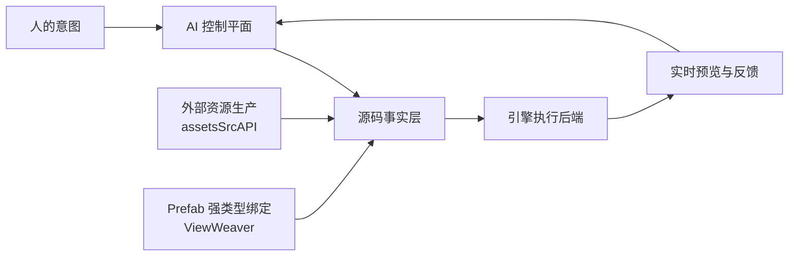

<div align="center">

# Kurenai Studio

### AI-native game creation, built around source code.

**AI 是作者 · 源码是事实 · 引擎是可替换的执行后端**

[Kurenai](https://github.com/kurenai-studio/kurenai) 是 PinK 的升级版：  
**项目管理 · 资源编译 · 预览 · 构建** 在同一产品里。只需安装 kurenai，不要单独装完整 cocos-cli / PinK。

</div>

---

## 一句话安装（给 Agent）

把下面整段丢给任务 Agent，它即可自学安装并开始做游戏：

```text
自学并只用最新 kurenai（https://github.com/kurenai-studio/kurenai：clone 后 Node.js 22+ 下 `npm install && npm link`；不要单独安装完整 cocos-cli / PinK）开发 Cocos 游戏：`kurenai init` → `host start` → 按项目 `AGENTS.md` 只改 `assets/game/` 与 `assets/resources/`，用 `asset info` / `logs` / `context` 闭环，`.meta` 由引擎生成、不要手写；`.prefab` / `.mtl` 可以直接手写，但 prefab 里不挂脚本组件，行为写在 TS 里用 `addComponent` 挂上；交付时再 `kurenai publish --platform web-desktop`。
```

人手动入口：[安装方法](https://github.com/kurenai-studio/kurenai/blob/main/docs/安装方法.md) · [简单使用方法](https://github.com/kurenai-studio/kurenai/blob/main/docs/简单使用方法.md) · [技术设计](https://github.com/kurenai-studio/kurenai/blob/main/docs/技术文档.md)

---

## What we are building

传统工具让 AI 学习操作编辑器。Kurenai Studio 选择另一条路线：

```text
人的意图
→ AI 理解、规划并修改源码
→ 引擎导入、编译和运行
→ 实时预览与错误反馈
→ AI 继续迭代
```

我们不试图复制一套供 AI 点击的 Hierarchy、Inspector 和菜单系统，而是建立更短、更透明的闭环：

- **Source-first** — 所有有效修改最终固化到工程文件。
- **Engine-light** — 引擎退回为资源编译器、运行时和结果验证器。
- **Agent-native** — 项目上下文、节点选择和运行反馈直接进入 Agent。
- **One install** — clone kurenai 即可；运行时自带于 `vendor/cocos-core`。
- **Reproducible** — 修改可比较、可审查、可回滚、可自动验证。

## Projects

### [Kurenai](https://github.com/kurenai-studio/kurenai)

PinK 继任的 Cocos AI 开发工作台：CLI + 内置裁剪运行时，覆盖项目、资源、预览与 web 构建；Agent 用一句话即可装好环境。

### [ViewWeaver](https://github.com/kurenai-studio/ViewWeaver)

从 Cocos Prefab 生成强类型 View 绑定，把节点结构转化为 AI 和 TypeScript 可以稳定理解、引用与维护的源码契约。

### [assetsSrcAPI](https://github.com/kurenai-studio/assetsSrcAPI)

AI 时代的数字资产供应链层。统一外部资源来源、内容寻址存储、版权与来源信息，以及面向 Cocos 等执行后端的导入适配。

### [Cocos Inspector](https://github.com/kurenai-studio/CososInspector)

面向 Cocos Creator 2.x/3.x 与 PixiJS 的运行时检查、场景快照和资源导出工具，为 Kurenai 提供项目理解与运行反馈能力。

### [harExplorer](https://github.com/kurenai-studio/harExplorer)

从 HAR 中识别、提取和预览纹理、Spine、位图字体、粒子与音频，为资源研究、迁移和复用提供工具链。

### [baseAIAutoCocos](https://github.com/kurenai-studio/baseAIAutoCocos)

早期 Cocos Creator AI 工具基座，保留传统 Creator 扩展集成路径，并作为架构演进与兼容性参考。

## Architecture



引擎仍然负责确定性的资源导入、编译、渲染、运行和构建。  
AI 负责理解意图、修改工程、分析结果并持续迭代。

## Current focus

- 稳定「一句话安装 → init → host → publish」全新机器闭环。
- 缩短源码修改到预览反馈的时间。
- 将 assetsSrcAPI 接入项目资源生产和导入流程。
- 统一运行时观察能力与 Agent 可读的错误/选中上下文。
- 建立可验证、可回滚的源码级 Scene 与 Prefab 修改能力。

## Status

项目仍处于快速演进阶段。接口与工程格式可能变化，欢迎通过各仓库 Issues 参与讨论。

<div align="center">

**Build for the AI that is coming, not the editor that is fading.**

</div>
